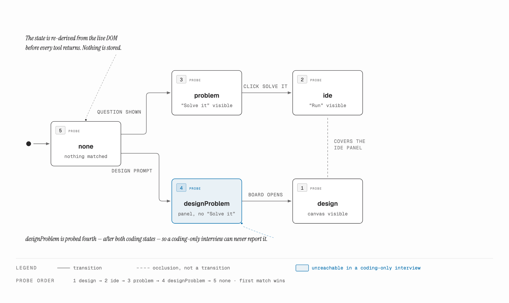

To test an AI interviewer, you need a candidate.

Not a fixture. Not a recorded transcript. Something that joins the call, listens, answers out loud, gets asked a follow-up it didn't expect, writes code in the editor, and talks through a system design — and does it differently every time, because that is what the product is being asked to handle.

So the candidate is an agent. This is how it is built, and the parts of it that surprised me.

## Table of contents

## The shape of the problem

The interviewer is an AI on a live video call. It speaks, it listens, it decides what to ask next. Around it sits a real web app: a conversation panel, a code editor, and a whiteboard for system-design questions.

A test harness has to occupy the candidate's seat in that app and be convincing enough that the interviewer behaves the way it would with a person. Three surfaces, one conversation, no script.

The obvious architecture is a loop: look at the page, decide, act, repeat. That is not what this is.

## The loop that isn't a loop

The agent runs on a tool-calling loop — the Vercel AI SDK's `ToolLoopAgent` — configured with `toolChoice: "required"`, which means it must call a tool on every step. It can never stall and produce prose into the void.

The tools are ordinary. `sendResponse` speaks. `editCode` writes into the editor. `runTestCases` clicks Run. `endInterview` ends it.

The part worth stopping on is `sendResponse`. It speaks, then it blocks on the interviewer's reply, and it **returns that reply as its own tool result**.

Which means the tool result is the next turn. The SDK's tool loop and the conversation are the same loop. There is no orchestrator, no `while` loop, no turn manager anywhere in the harness — the entire interview is a single `generate()` call that returns when the agent decides to call `endInterview`.

I did not design that. I wrote the obvious thing, noticed the outer loop had nothing left to do, and deleted it.


## The agent has no eyes

The model cannot see the page. It gets text, and text only.

That is a problem when there are three surfaces and the right action depends on which one is currently showing. Ask for a code edit while the whiteboard is covering the editor and you get a tool call that silently does nothing.

The first version solved this with navigation tools — `showCodingPanel`, `showDesignBoard`, one per surface. It worked, and it was wrong. It gave the model four extra ways to be in the wrong place, and made every interesting failure a navigation failure.

What replaced it: **every tool result comes back with a state stamp.**

```ts
async function formatResult(body: string): Promise<string> {
  await refreshSurface();          // re-read the live DOM
  return `surface=${currentSurface}\n${body}`;
}
```

Every result, without exception, tells the model where it is standing. `surface=ide`. `surface=design`. The navigation tools are gone; each acting tool quietly navigates to the surface it needs before doing its work.

The state is never stored and trusted. It is re-derived from the DOM before every single tool returns, because the page can change underneath the agent between one turn and the next — and it does, constantly, since a second AI is driving the other side of it.

## The probe order is load-bearing

Deriving the state is four visibility checks in a fixed order, and the order is the design:

```ts
if      (await whiteboard.isVisible())          currentSurface = "design";
else if (await codingWorkbench.isVisible())     currentSurface = "ide";
else if (await codingProblemPanel.isVisible())  currentSurface = "problem";
else if (await designProblemPanel.isVisible())  currentSurface = "designProblem";
else                                            currentSurface = "none";
```

`design` is checked first because the whiteboard visually covers the coding panel. Check in the other order and an open whiteboard reports `ide`, and the agent tries to type code into a canvas.

`designProblem` is checked last, after both coding states, and the reason is worth being precise about. The design-brief check is "the panel is showing and there is no Solve it button". I could not establish that the coding problem phase never renders a panel that would also satisfy it. Rather than go and prove it, I ordered the checks so that it cannot matter: by the time that branch is reachable, both coding checks have already failed, so a programming interview can never be routed down the design path.



That is the part I would keep if I rebuilt this. Not the specific order — the habit of spending ordering, which is free, instead of spending a proof. An assertion tells you the bug happened. A structure that cannot produce it never asks.

## Tools return errors as strings

`toolChoice: "required"` has a sharp edge. The agent must call a tool every step, and if a tool throws, the exception propagates out of `generate()` and the whole thing unwinds.

That call is live. There is an interviewer on the other end, mid-question. Ending the process because a selector timed out is not an acceptable failure mode.

So every tool catches its own errors and returns them as a string:

```ts
catch (error) {
  return `Error reading question context: ${errText(error)}`;
}
```

An error becomes something the model can read and react to — retry, ask a clarifying question, move on — instead of something that kills the run.

There is exactly one deliberate exception. Writing code into the editor verifies itself by reading the buffer back, and throws if the write did not land. That is an invariant violation, not a transient failure: if the editor silently dropped the write, everything after it is fiction. It throws, and the tool's own catch turns it into a string one level up.

## Speaking without a microphone

There is no microphone and no text-to-speech. The candidate's "speech" is text injected directly over the interview's WebSocket.

That is not a shortcut, it is the only thing that works. Synthesising audio, playing it into a virtual microphone, and hoping the other end's speech recognition transcribes it faithfully would make every test a test of the audio pipeline. The thing under test is the interviewer's reasoning.

Two details from that layer are worth passing on.

The first is turn-taking. To interrupt the interviewer you send an interrupt, then wait for it to confirm it has stopped speaking. **The waiter has to be armed before the interrupt is sent** — otherwise a fast confirmation arrives before anything is listening for it, and you wait forever for an event that already happened. Classic, and it only shows up under load.

The second is that `ws.send()` on a socket in the CLOSING state does not throw. It silently drops the frame. So the send path selects the newest open socket every time rather than caching a reference — a cached socket that closed is a message that vanishes with no error anywhere.

## What it found

The point of all this is to catch things, and the thing it caught first was not a bug in my harness.

System-design questions put a brief on screen. The interviewer announces it is doing so — and never reads the brief aloud. A human tester glances at the panel, absorbs it without noticing, and moves on. My candidate could not. It had no eyes; it only had the transcript. So it answered a question it had never been told.

That is an accessibility gap. Anyone relying on the audio — a screen-reader user, someone who looked away — gets the same non-experience my agent got. It surfaced because the automated candidate had a strictly narrower sensory channel than a human tester, and the narrower channel is what made the gap visible.

The fix was one rule: fetch the question text before answering a design question. The finding was worth more than the fix.

## What I would tell you if you are building one

Give the agent fewer tools and better results. Navigation tools looked like capability and were actually four new ways to be lost; a state stamp on every result did the same job with none of the surface area.

Never let a tool throw in a loop where a throw ends a live session. Return the error as data and let the model decide.

And when you catch yourself about to prove that some state can't happen, check whether you can just order things so the question never comes up. Proofs rot. Ordering doesn't.
